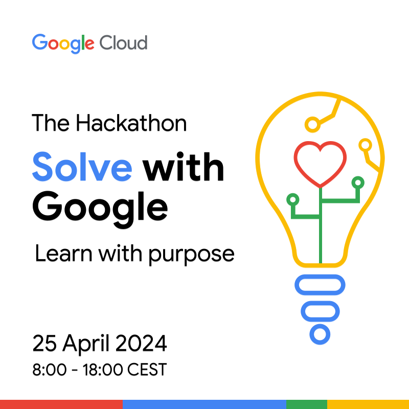

<div align="center" id="top"> 
  

  &#xa0;

  <!-- <a href="https://swg.netlify.app">Demo</a> -->
</div>

<h1 align="center">Solve With Google - Healthcare Assistant Chatbot</h1>

<p align="center">
  

  

  

  

  <!--  -->

  <!--  -->

  <!--  -->
</p>

<!-- Status -->

<!-- <h4 align="center"> 
	🚧  Swg 🚀 Under construction...  🚧
</h4> 

<hr> -->

<p align="center">
  <a href="#dart-about">About</a> &#xa0; | &#xa0; 
  <!-- <a href="#sparkles-features">Features</a> &#xa0; | &#xa0; -->
  <a href="#rocket-technologies">Technologies</a> &#xa0; | &#xa0;
  <a href="#white_check_mark-requirements">Requirements</a> &#xa0; | &#xa0;
  <a href="#checkered_flag-starting">Starting</a> &#xa0; | &#xa0;
  <a href="#memo-license">License</a> &#xa0; | &#xa0;
  <a href="https://github.com/gatolgaj" target="_blank">Author</a>
</p>

<br>

## :dart: About ##

Using [Google Gemini](https://deepmind.google/technologies/gemini/), a family of large language models from Google DeepMind, known for its ability to understand and respond to different kinds of information, we will create a ChatBot to serve as a Virtual Assistant during the patient’s care journey


## :rocket: Technologies ##

The following tools were used in this project:

- [Python](https://www.python.org/)
- [GCloud CLI](https://cloud.google.com/sdk/docs/install)
- [Chainlit](https://docs.chainlit.io/)
- [Google Gemini](https://deepmind.google/technologies/gemini/)
- [Google Cloud VertexAI](https://cloud.google.com/vertex-ai?hl=en)

## :white_check_mark: Requirements ##

Before starting :checkered_flag:, you need to have [Python](https://www.python.org/), [Chainlit](https://docs.chainlit.io/get-started/installation) and [GCloud CLI](https://cloud.google.com/sdk/docs/install) installed.

## :checkered_flag: Starting ##

**1.** Make sure that you have docker installed.

**2.** Login to google gloud and setup the projrct. Make sure that Vertex AI is enabled.

````
gcloud auth application-default login
gcloud config set project <PROJECT_ID>
````

**3.**  Create a .env file and add the following env varibales
````
OPENAI_API_KEY=sk-<***************************>
QDRANT_URL=http://localhost:6333
````

Then run the script

````
chmod +x run.sh 
./run.sh
````

The Script will do the following

* Run Qdrant Database in case its not running
* Install the requirements
* extract the content of the PDF file in pdfInput folder and upload it to qdrant.
* extract the content of the text file in Pdata Folder.
* start the chatbot application
* The page is available in <http://localhost:8000>


## :memo: License ##

This project is under license from MIT. For more details, see the [LICENSE](LICENSE.md) file.

## Authors ##
Made with :heart: by Deloitte Consulting BV --  Amsterdam, Netherlands

Authors: Shyam Sundar, Joshua Goldberg, Wouter ten Brink, Gino Arcangeli    

&#xa0;

<a href="#top">Back to top</a>

